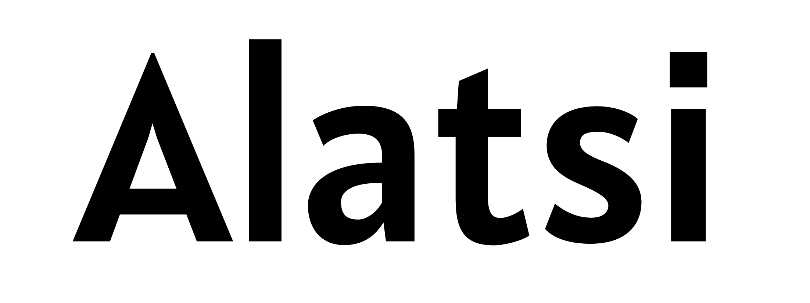

# Alatsi

[![][Fontbakery]](https://SorkinType.github.io/Alatsi/fontbakery/fontbakery-report.html)
[![][Universal]](https://SorkinType.github.io/Alatsi/fontbakery/fontbakery-report.html)
[![][GF Profile]](https://SorkinType.github.io/Alatsi/fontbakery/fontbakery-report.html)
[![][Outline Correctness]](https://SorkinType.github.io/Alatsi/fontbakery/fontbakery-report.html)
[![][Shaping]](https://SorkinType.github.io/Alatsi/fontbakery/fontbakery-report.html)

[Fontbakery]: https://img.shields.io/endpoint?url=https%3A%2F%2Fraw.githubusercontent.com%2FSorkinType%2FAlatsi%2Fgh-pages%2Fbadges%2Foverall.json
[GF Profile]: https://img.shields.io/endpoint?url=https%3A%2F%2Fraw.githubusercontent.com%2FSorkinType%2FAlatsi%2Fgh-pages%2Fbadges%2FGoogleFonts.json
[Outline Correctness]: https://img.shields.io/endpoint?url=https%3A%2F%2Fraw.githubusercontent.com%2FSorkinType%2FAlatsi%2Fgh-pages%2Fbadges%2FOutlineCorrectnessChecks.json
[Shaping]: https://img.shields.io/endpoint?url=https%3A%2F%2Fraw.githubusercontent.com%2FSorkinType%2FAlatsi%2Fgh-pages%2Fbadges%2FShapingChecks.json
[Universal]: https://img.shields.io/endpoint?url=https%3A%2F%2Fraw.githubusercontent.com%2FSorkinType%2FAlatsi%2Fgh-pages%2Fbadges%2FUniversal.json

Alatsi is a Compressed geometric with a perky character. It also has a broad language support.

Alatsi is an original typeface designed by [Spyros Zevelakis](https://www.2xux.com).

Eben Sorkin from Sorkin Type Co. art directed, kerned and added languages to Voltaire.

513 languages of Latin script:
------------------------------
Abidji, Abron, Abua, Acheron, Achinese, Acholi, Achuar-Shiwiar, Adamawa Fulfulde, Adangme, Adele, Afar, Afrikaans, Aghem, Agni, Aguaruna, Ahanta, Ahtna, Aja (Benin), Akebu, Akoose, Alekano, Aleut, Amahuaca, Amarakaeri, Amis, Anaang, Andaandi, Dongolawi, Angas, Anii, Anufo, Anuta, Ao Naga, Apinayé, Arabela, Aragonese, Arbëreshë Albanian, Arvanitika Albanian, Asháninka, Ashéninka Perené, Asturian, Asu (Tanzania), Atayal, Avatime, Awa-Cuaiquer, Awetí, Awing, Ayizo Gbe, Baatonum, Bafia, Bagirmi Fulfulde, Balante-Ganja, Balinese, Balkan Romani, Bambara, Baoulé, Bari, Basque, Bassari, Batak Dairi, Batak Karo, Batak Mandailing, Batak Simalungun, Batak Toba, Bemba (Zambia), Bena (Tanzania), Biali, Bikol, Bini, Bislama, Bissa, Boko (Benin), Bomu, Bora, Borana-Arsi-Guji Oromo, Borgu Fulfulde, Bosnian, Bouna Kulango, Breton, Buamu, Buginese, Bushi, Candoshi-Shapra, Caquinte, Caribbean Hindustani, Cashibo-Cacataibo, Cashinahua, Catalan, Cebuano, Central Aymara, Central Kurdish, Central Mazahua, Central Nahuatl, Central-Eastern Niger Fulfulde, Cerma, Chachi, Chamorro, Chavacano, Chayahuita, Chiga, Chiltepec Chinantec, Chokwe, Chuukese, Cimbrian, Cofán, Congo Swahili, Cook Islands Māori, Cornish, Corsican, Creek, Crimean Tatar, Croatian, Czech, Dagbani, Danish, Dehu, Dendi (Benin), Dimli, Dinka, Ditammari, Duala, Dutch, Dyan, Dyula, Eastern Arrernte, Eastern Maninkakan, Eastern Oromo, Efik, Embu, English, Ese Ejja, Ewe, Ewondo, Falam Chin, Fanti, Farefare, Faroese, Fe'Fe', Fijian, Filipino, Finnish, Fon, Foodo, French, Friulian, Ga, Gagauz, Galician, Ganda, Garifuna, Ga’anda, Gen, German, Gheg Albanian, Gilbertese, Gonja, Gooniyandi, Gourmanchéma, Guadeloupean Creole French, Guinea Kpelle, Gusii, Gwichʼin, Haitian, Hakha Chin, Hani, Hassaniyya, Hausa, Hawaiian, Hiligaynon, Ho-Chunk, Hopi, Huastec, Hungarian, Hän, Ibibio, Icelandic, Idoma, Ifè, Igbo, Iloko, Inari Sami, Indonesian, Irish, Istro Romanian, Italian, Ixcatlán Mazatec, Jamaican Creole English, Japanese, Javanese, Jenaama Bozo, Jola-Fonyi, K'iche', Kabiyè, Kabuverdianu, Kabyle, Kaingang, Kako, Kala Lagaw Ya, Kalaallisut, Kalenjin, Kamba (Kenya), Kanuri, Kaonde, Kaqchikel, Kara-Kalpak, Karelian, Karo, Kasem, Kashubian, Kekchí, Kenzi, Mattokki, Khasi, Kikuyu, Kimbundu, Kinyarwanda, Kirmanjki, Kituba (DRC), Kom (Cameroon), Kongo, Konzo, Koonzime, Koyra Chiini Songhay, Koyraboro Senni Songhai, Krio, Kuanyama, Kusaal, Kven Finnish, Kwasio, Kölsch, Ladin, Ladino, Lakota, Lama, Lamnso', Langi, Latgalian, Ligurian, Lingala, Lithuanian, Lobi, Lombard, Low German, Lower Sorbian, Lozi, Luba-Katanga, Luba-Lulua, Lukpa, Lule Sami, Luo (Kenya and Tanzania), Luxembourgish, Lyele, Láá Láá Bwamu, Maasina Fulfulde, Macedo-Romanian, Madurese, Makhuwa, Makhuwa-Meetto, Makonde, Makwe, Malagasy, Malaysian, Malba Birifor, Maltese, Mam, Mamara Senoufo, Mandinka, Mandjak, Mankanya, Manx, Maore Comorian, Maori, Mapudungun, Marshallese, Masai, Masana, Matsés, Mauritian Creole, Mbelime, Medumba, Megleno Romanian, Mende (Sierra Leone), Meriam Mir, Meru, Meta’, Metlatónoc Mixtec, Mezquital Otomi, Mi'kmaq, Minangkabau, Mirandese, Miyobe, Mizo, Moba, Mohawk, Montenegrin, Mossi, Mundang, Munsee, Murrinh-Patha, Murui Huitoto, Muslim Tat, Mwani, Ménik, Mískito, Naga Pidgin, Nateni, Navajo, Nawdm, Ndonga, Ndrulo, Neapolitan, Ngazidja Comorian, Ngiemboon, Ngomba, Nigerian Fulfulde, Niuean, Nobiin, Nomatsiguenga, Noon, North Azerbaijani, North Marquesan, North Ndebele, Northeastern Dinka, Northern Bobo Madaré, Northern Dagara, Northern Kissi, Northern Kurdish, Northern Qiandong Miao, Northern Sami, Northern Uzbek, Norwegian, Nuer, Nyamwezi, Nyanja, Nyankole, Nyemba, Nzima, Occitan, Ojitlán Chinantec, Orma, Oroqen, Otuho, Palauan, Paluan, Pampanga, Papantla Totonac, Papiamento, Paraguayan Guaraní, Pedi, Phuie, Picard, Pichis Ashéninka, Piemontese, Pijin, Pintupi-Luritja, Pipil, Pite Sami, Pohnpeian, Polish, Portuguese, Potawatomi, Prussian, Pulaar, Pular, Purepecha, Páez, Quechua, Romanian, Romansh, Rotokas, Rundi, Rwa, Saafi-Saafi, Samburu, Samoan, Sango, Sangu (Tanzania), Saramaccan, Sardinian, Saxwe Gbe, Scottish Gaelic, Secoya, Sena, Serer, Seri, Seselwa Creole French, Shambala, Sharanahua, Shawnee, Shilluk, Shipibo-Conibo, Shona, Shuar, Sicilian, Silesian, Siona, Sissala, Skolt Sami, Slovak, Slovenian, Soga, Somali, Soninke, South Azerbaijani, South Marquesan, South Ndebele, Southern Aymara, Southern Bobo Madaré, Southern Dagaare, Southern Nuni, Southern Qiandong Miao, Southern Sami, Southern Samo, Southern Sotho, Spanish, Sranan Tongo, Standard Estonian, Standard Latvian, Standard Malay, Sundanese, Susu, Swahili, Swati, Swedish, Swiss German, Syenara Senoufo, Tagalog, Tahitian, Taita, Talysh, Tasawaq, Tawallammat Tamajaq, Tedim Chin, Tem, Tetum, Tetun Dili, Ticuna, Tigon Mbembe, Tikar, Timne, Tiv, Tiéyaxo Bozo, Toba, Tojolabal, Tok Pisin, Tokelau, Toma, Tonga (Tonga Islands), Tonga (Zambia), Tosk Albanian, Totontepec Mixe, Tsafiki, Tsakhur, Tsonga, Tswana, Tumbuka, Turka, Turkish, Turkmen, Tuvalu, Twi, Tzeltal, Tzotzil, Uab Meto, Umbundu, Ume Sami, Upper Guinea Crioulo, Upper Sorbian, Urarina, Venda, Venetian, Veps, Vietnamese, Vlax Romani, Võro, Waama, Waci Gbe, Wallisian, Walloon, Walser, Wamey, Wangaaybuwan-Ngiyambaa, Waorani, Waray (Philippines), Warlpiri, Wasa, Wayuu, Welsh, West Central Oromo, West-Central Limba, Western Abnaki, Western Frisian, Western Niger Fulfulde, Wik-Mungkan, Winyé, Wiradjuri, Wolof, Xavánte, Xhosa, Xwela Gbe, Yagua, Yanesha', Yangben, Yanomamö, Yao, Yapese, Yindjibarndi, Yom, Yoruba, Yucateco, Zapotec, Zarma, Zulu, Zuni, Záparo

513 languages supported in total.

## About

Description of you and/or organisation goes here.

## Building

Fonts are built automatically by GitHub Actions - take a look in the "Actions" tab for the latest build.

If you want to build fonts manually on your own computer:

* `make build` will produce font files.
* `make test` will run [FontBakery](https://github.com/googlefonts/fontbakery)'s quality assurance tests.
* `make proof` will generate HTML proof files.

The proof files and QA tests are also available automatically via GitHub Actions - look at https://SorkinType.github.io/Alatsi.

## Changelog

** 18 October 2023 Version 1.006
Increased language support

## License

This Font Software is licensed under the SIL Open Font License, Version 1.1.
This license is available with a FAQ at
https://scripts.sil.org/OFL

## Repository Layout

This font repository structure is inspired by [Unified Font Repository v0.3](https://github.com/unified-font-repository/Unified-Font-Repository), modified for the Google Fonts workflow.
